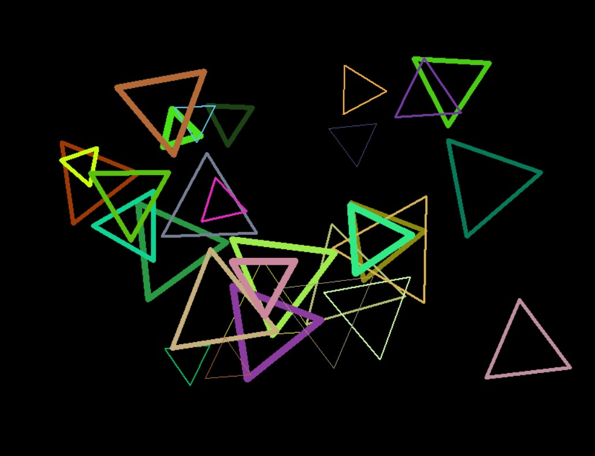
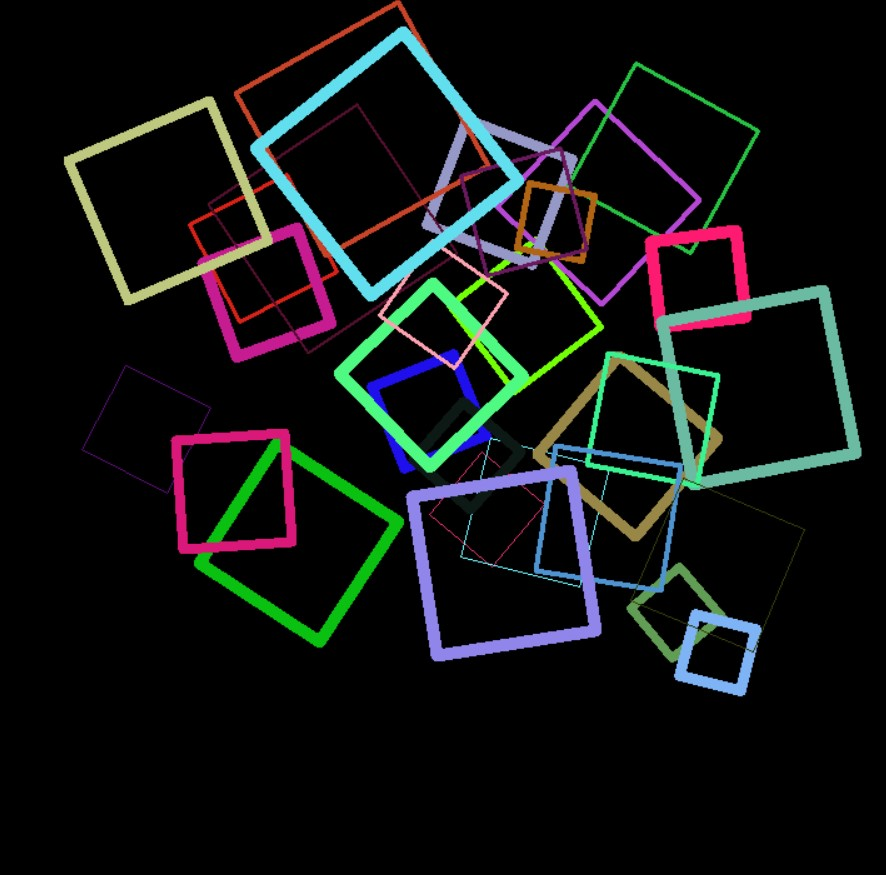
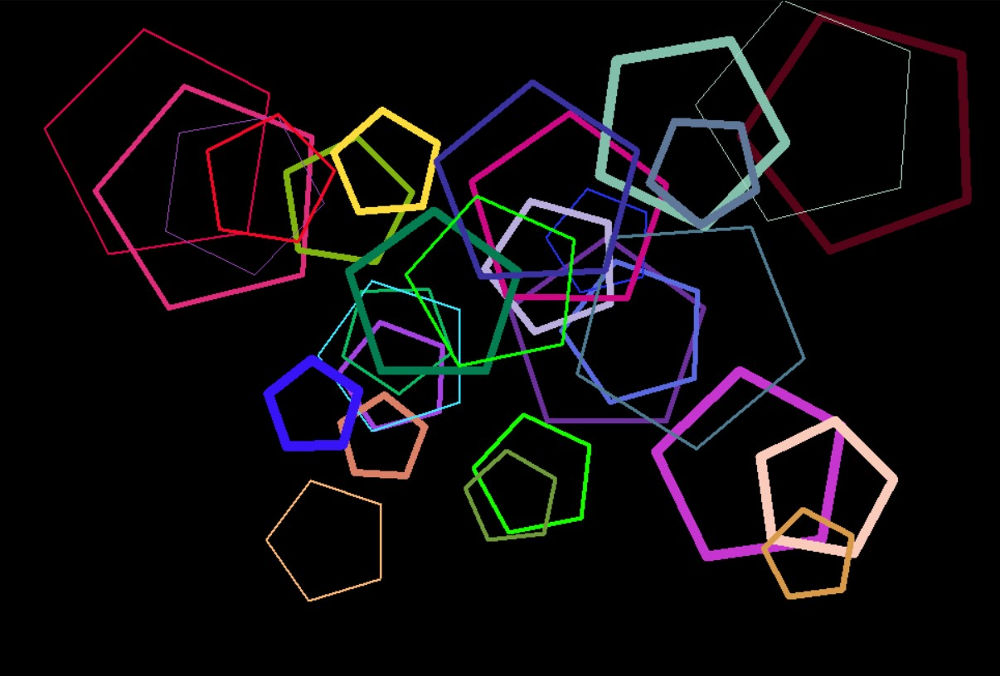
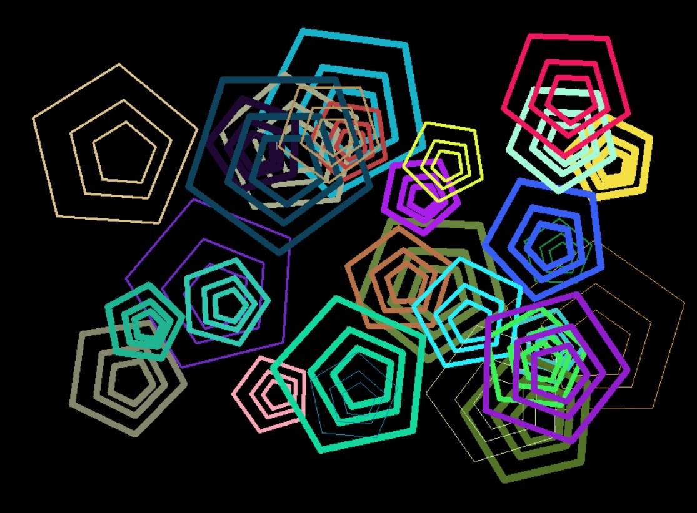
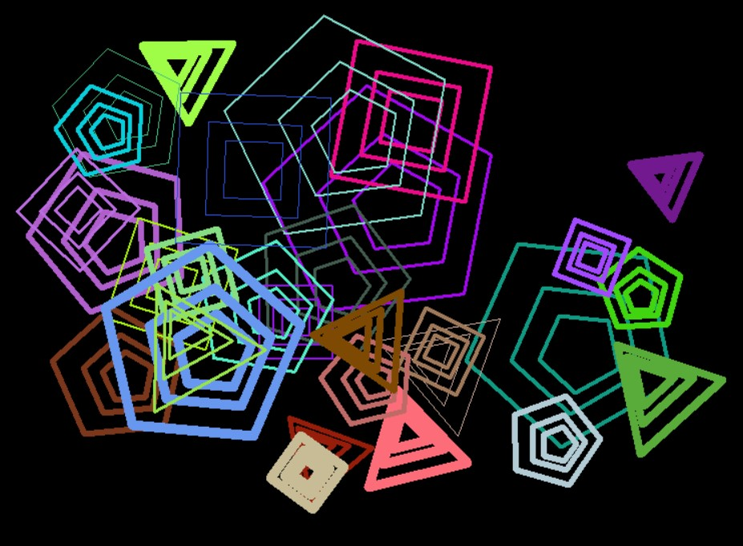

# final-exam
- From the starting code, polygon_art.py, you are to write an OO program that generates different pieces of art works
- Fork, then, clone this repo
- Read the instructions given in the course's Google Classroom and start coding
- Once you are done, push your final code to your Github repo and modify this README to report on the work you have done
# Usage
run using python interpreter:
```sh
$ python polygon_art.py
```
You will be given a choice, 1-8 (inclusive), just type in your choice and press enter.  
The art will be displayed in the turtle screen.  
Here is an example choice 1:  
```sh
$ python polygon_art.py
Which art do you want to generate? Enter a number between 1 to 8, inclusive: 1
```

There are no bugs found at the moment if you found any bugs, please open an issue.  
The examples of the arts are given in the repo as `art1.jpg` and so on.
# Art 1
</img>
# Art 2
</img>
# Art 3
</img>
# Art 4
</img>
# Art 5
</img>
# Art 6
</img>
# Art 7
</img>
# Art 8
</img>